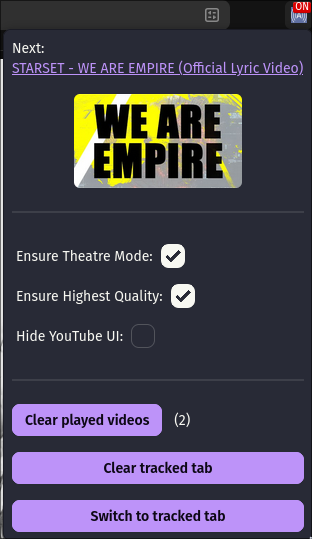
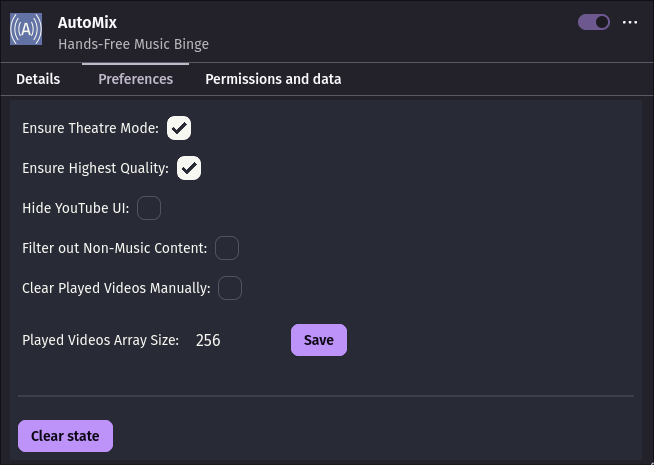

# AutoMix

**Hands-Free Music Binge on YouTube.**
Turn any video into a mix, all in one tab, without ever enabling YouTube's global autoplay.

## Why AutoMix?

When you enable YouTube's autoplay and start a music video, the platform automatically switches to its *Mix/Radio* mode. 
This may not always be desirable, and once autoplay is enabled for music-type videos, there's no convenient way to turn it off.
To address this, the extension lets you enjoy a *Mix*-like experience on any video while limiting it to a single tab, without the need for enabling autoplay globally.

YouTube also likes to mess with quality when set to *Auto*; this extension ensures that the highest available quality is always selected.

## Features
- Recommendation-based mixes from any video
- Integration with system Media Controls
- Integration with player UI to add play next and play prev button
- Adds "Play Next" / "Play Previous" buttons to the player
- Keeps Theater mode enabled throughout playback
- Ensures that the Highest quality is used for playback
- Ability to hide YouTube UI during playback, only preserving player 
- Automatic filtering of non-music content
- Playback history can be persisted across multiple sessions, avoiding repeats
- Quick switch to the AutoMix‑controlled tab from the extension popup

## Preview

<p align="center">

</p>
<p align="center">


</p>


## Building

[Devbox](https://www.jetify.com/devbox) is chosen because it guarantees a consistent development environment.

- Clone the repository and run `devbox install` - set up the project environment.
- To build the extension `dist/` directory run:  
```sh
    devbox run build
```

## Install

<a href="https://github.com/xdmpx/automix/releases"></a> 

### Firefox

The extension is not published on the Firefox Add-ons.

To install download the latest `.xpi` file from the <a href="/xdmpx/automix/releases">releases</a> page.

In Firefox, open `about:addons` -> `Install Add‑on From File...` and select the downloaded `.xpi`.


### Chromium‑based browsers

This extension is not distributed for Chromium‑based browsers.

To install first build the extension.

To install temporarily:
 - Open `chrome://extensions/`
 - Enable `Developer mode`
 - Click `Load unpacked` and choose the `dist/` folder

 To install permanently:
 - Open `chrome://extensions/`
 - Enable `Developer mode`
 - Click `Pack extension` and choose the `dist/` folder
 - Drag-and-drop crated `.crx` file onto the `chrome://extensions` page

## License

This project is licensed under [MIT](LICENSE) License.
